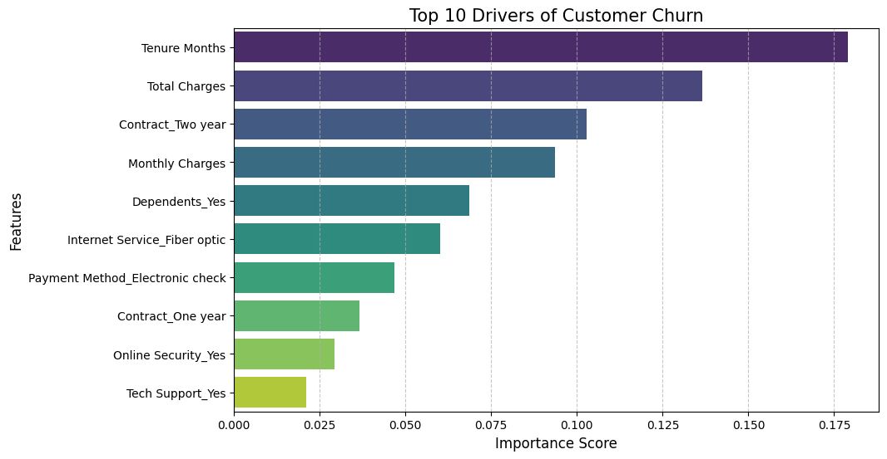
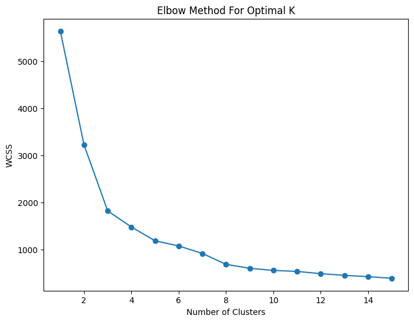
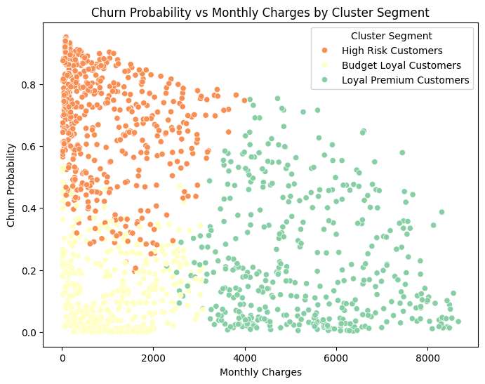

# 🚀 Telecom Customer Churn: End-to-End Predictive Analytics & Strategy

## 📌 Overview
This project delivers a comprehensive, end-to-end data science solution to predict customer churn in the telecommunications industry. By leveraging machine learning and customer segmentation, the project transforms raw data into actionable business strategies.

## 🛠 Project Workflow (ATS Optimized)
The project follows a rigorous end-to-end pipeline:
* **Data Cleaning**: Handled missing values (e.g., 'Total Charges') and performed robust preprocessing.
* **Encoding & EDA**: Conducted Exploratory Data Analysis (EDA) and utilized label encoding to prepare data for modeling.
* **Feature Selection**: Optimized the model by identifying the most influential predictors of churn.
* **Machine Learning**: 
    * Implemented **Random Forest Classifier** with `class_weight='balanced'` to handle class imbalance.
    * Performed extensive **Hyperparameter Tuning** to maximize model recall and precision.
* **Advanced Analytics**:
    * **Cross-Validation**: Ensured model robustness through 5-fold cross-validation.
    * **ROC-AUC Analysis**: Evaluated model discriminative power beyond simple accuracy.
    * **Customer Segmentation**: Used **K-Means Clustering** with the Elbow Method to determine optimal 'K' and group customers into strategic personas.

## 💡 Unique Business Insights
* **Financial Impact Quantification**: Calculated the potential monthly revenue loss based on churn predictions, enabling prioritized interventions.
* **Strategic Retention Framework**: 
    * **Loyal Premium**: Exclusive rewards and early access.
    * **Budget Loyal**: Personalized upgrade offers.
    * **High Risk**: Immediate "Save Team" intervention.
* **Explainable AI**: Visualized the **Top 10 Drivers of Churn** to provide business-ready transparency.

## 📊 Visualizations

## 🛠 Tech Stack
* **Language**: Python
* **Libraries**: Pandas, NumPy, Seaborn, Matplotlib, Scikit-Learn
* **Models**: RandomForestClassifier, KMeans

---
*Created by [Tera Naam]*
